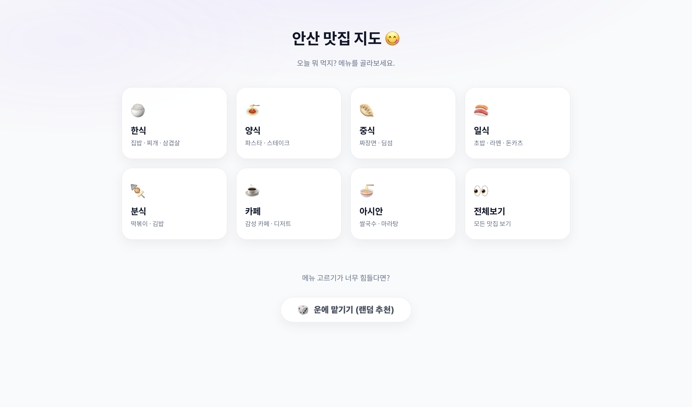
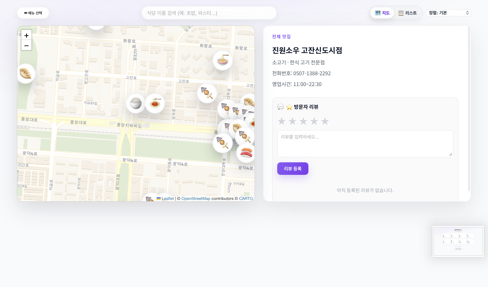
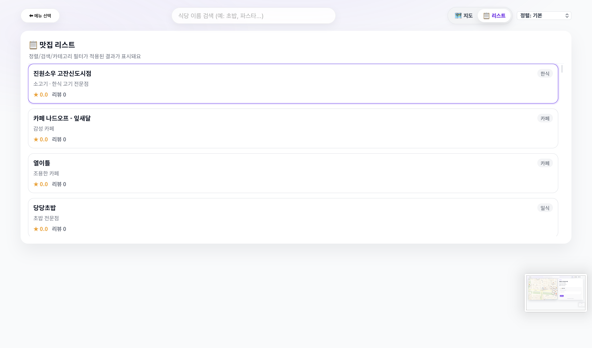

😋 안산 맛집 지도 (Ansan Gourmet Map)

안산 지역의 숨은 맛집을 카테고리별로 큐레이션하여 지도와 리스트로 보여주는 웹 애플리케이션입니다.
사용자는 먹고 싶은 메뉴를 선택하거나, 특정 식당을 검색하고, 방문자 리뷰를 남기며 맛집 정보를 공유할 수 있습니다.

📸 스크린샷

메인(카테고리) 화면

지도 뷰 & 상세 정보

리스트 뷰 & 정렬

✨ 주요 기능

1. 카테고리별 맛집 탐색

8가지 카테고리 분류: 한식, 양식, 중식, 일식, 분식, 카페, 아시안, 전체보기.

직관적인 UI: 이모지와 함께 구성된 카드 UI로 메뉴를 쉽게 선택할 수 있습니다.

2. 인터랙티브 지도 (Leaflet.js)

OpenStreetMap 기반: 안산 지역 중심의 지도를 제공하며, 마우스 휠과 터치로 자유롭게 확대/축소가 가능합니다.

커스텀 마커: 음식 종류별로 다른 이모지 마커(🍚, 🍝, ☕ 등)를 사용하여 시각적 구분이 쉽습니다.

반응형 패널: 마커 클릭 시 식당의 상세 정보(전화번호, 영업시간, 예약 링크 등)가 표시됩니다.

3. 리스트 뷰 & 정렬 필터 (New!) 📋

뷰 전환: 지도 보기와 리스트 보기를 버튼 하나로 간편하게 전환할 수 있습니다.

다양한 정렬 옵션:

⭐ 별점 높은 순: 사용자 평점이 높은 맛집부터 보기

🗣️ 리뷰 많은 순: 리뷰가 가장 활발한 맛집부터 보기

🔡 이름순: 가나다 순으로 정렬

4. 사용자 리뷰 시스템 ⭐

별점 및 리뷰 작성: 사용자가 직접 별점(1~5점)과 후기를 남길 수 있습니다.

데이터 저장 (LocalStorage): 작성한 리뷰는 브라우저의 로컬 스토리지에 저장되어 새로고침 후에도 유지됩니다.

실시간 평점 반영: 리뷰 작성 즉시 식당의 평균 별점과 리뷰 개수가 갱신됩니다.

5. 강력한 검색 기능 🔍

실시간 자동 완성: 식당 이름의 일부만 입력해도 연관된 식당 목록을 추천해줍니다.

스마트 포커싱: 검색 결과 클릭 시 해당 식당의 위치로 지도가 이동하며 상세 정보가 열립니다.

6. 랜덤 맛집 추천 (결정 장애 해결!) 🎲

"오늘 뭐 먹지?" 고민될 때 사용할 수 있는 랜덤 뽑기 기능을 제공합니다.

룰렛처럼 전체 맛집 중 하나를 무작위로 선정하여 보여줍니다.

🛠 사용 기술 (Tech Stack)

Frontend: HTML5, CSS3, JavaScript (Vanilla ES6)

Library: Leaflet.js (오픈소스 지도 라이브러리)

Font: Google Fonts (Noto Sans KR)

Storage: Web LocalStorage API (리뷰 데이터 영구 저장)

📂 프로젝트 구조

📦 ansan-food-map
 ┣ 📜 index.html      # 메인 HTML 구조 (화면 레이아웃, CDN 링크)
 ┣ 📜 style.css       # 반응형 디자인, 지도/리스트 스타일링
 ┣ 📜 script.js       # 핵심 로직 (지도 렌더링, 데이터 관리, 리뷰 시스템)
 ┗ 📜 README.md       # 프로젝트 설명서

🚀 실행 방법

별도의 설치 과정 없이 웹 브라우저만 있으면 실행 가능합니다.

이 저장소를 다운로드하거나 클론(Clone)합니다.

index.html 파일을 더블 클릭하여 웹 브라우저(Chrome, Edge, Safari 등)에서 엽니다.

안산의 맛집을 탐험하세요!

📝 데이터 출처 및 관리

맛집 데이터는 script.js 내부의 stores 배열 객체로 관리됩니다.

새로운 식당을 추가하려면 stores 배열에 아래 형식을 따라 객체를 추가하면 됩니다.

{
    name: "식당이름",
    category: "한식", // 카테고리 지정
    lat: 37.XXXX,    // 위도
    lng: 126.XXXX,   // 경도
    desc: "설명",
    phone: "031-000-0000",
    hours: "10:00~22:00",
    reserve: "예약링크URL" // 없으면 빈 문자열 ""
}

© 2025 Ansan Gourmet Map Project.