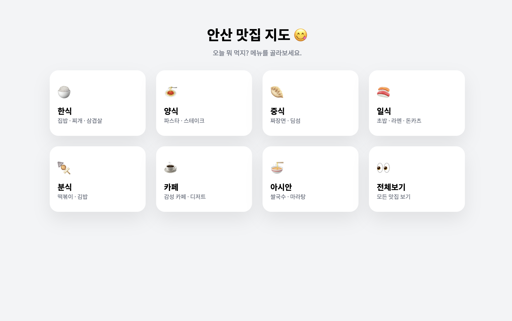

# 😋 안산 맛집 지도 (Ansan Gourmet Map)

안산 지역의 숨은 맛집을 카테고리별로 큐레이션하여 지도로 보여주는 웹 애플리케이션입니다.
사용자는 먹고 싶은 메뉴(한식, 중식, 일식 등)를 선택하거나, 특정 식당을 검색하여 위치와 정보를 손쉽게 확인할 수 있습니다.

## 📸 스크린샷

| 카테고리 선택 화면 | 지도 및 정보 화면 |
| :---: | :---: |
|  | *(스크린샷 이미지를 여기에 넣어주세요)* |

## ✨ 주요 기능

### 1. 카테고리별 맛집 탐색
- 한식, 양식, 중식, 일식, 카페 등 **8가지 카테고리**로 맛집을 분류했습니다.
- 직관적인 카드 UI를 통해 원하는 종류의 음식을 쉽게 고를 수 있습니다.

### 2. 인터랙티브 지도 (Leaflet.js)
- **OpenStreetMap** 기반의 지도를 사용하여 안산 지역의 위치를 보여줍니다.
- 선택한 카테고리에 해당하는 식당만 마커(핀)로 표시됩니다.
- 마커를 클릭하면 우측(모바일은 하단) 패널에 식당의 상세 정보(전화번호, 영업시간, 예약 링크 등)가 표시됩니다.

### 3. 강력한 검색 기능 🔍
- **전체 검색:** 현재 선택된 카테고리와 상관없이 모든 맛집을 검색할 수 있습니다.
- **자동 완성:** 식당 이름의 일부만 입력해도 연관된 식당 목록을 실시간으로 보여줍니다.
- **키보드 지원:** 검색어를 입력하고 `Enter` 키를 누르면 가장 연관성 높은 식당으로 즉시 이동합니다.

### 4. 반응형 디자인 (Responsive Web)
- **Desktop:** 좌측 지도, 우측 정보 패널의 넓은 레이아웃.
- **Mobile:** 상단 지도, 하단 정보 패널로 자동 전환되어 모바일에서도 편하게 볼 수 있습니다.

## 🛠 사용 기술 (Tech Stack)

- **Frontend:** HTML5, CSS3, JavaScript (Vanilla ES6)
- **Library:** [Leaflet.js](https://leafletjs.com/) (지도 구현)
- **Font:** Google Fonts (Noto Sans KR)

## 📂 프로젝트 구조

```text
📦 ansan-food-map
 ┣ 📜 index.html      # 메인 HTML 구조 (화면 레이아웃)
 ┣ 📜 style.css       # 전체 디자인 및 반응형 스타일
 ┗ 📜 script.js       # 지도 로직, 검색 기능, 맛집 데이터 관리